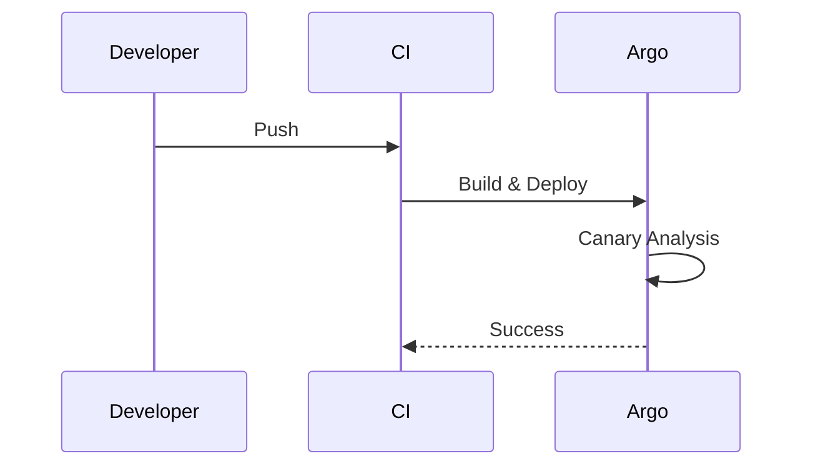
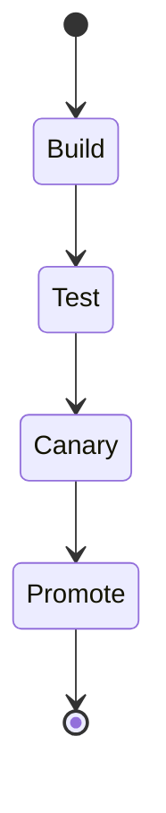

# Task 9.5 — Release Governance Architecture
**Domain Prefix:** RELGOV
**Context:** StoryOS Evolutionary Modular Monolith, DDD+CQRS+Event Sourcing

## 1. Preface
This document defines the Release Governance Architecture for StoryOS. 
It supersedes all prior designs.

## 2. Executive Overview
Release types (hotfix: emergency <4h; patch: bugfix <24h; minor: weekly cadence; major: monthly, requires migration plan + ADR), release train (Tuesday 10am UTC + Thursday 2pm UTC windows — automated CI gate prevents merge outside windows for non-hotfix), feature flag governance (LaunchDarkly: all new features behind flags, flag lifecycle CREATED->TESTING->RAMPING->FULL->REMOVED, max flag lifetime 90 days before mandatory cleanup), database migration governance (Flyway versioned migrations, backwards-compatible migrations only in minor releases, breaking schema changes require 2-phase: additive in minor -> remove old in next major), rollback (Argo Rollouts: automated canary with SLO analysis — if error rate >1% or latency p99 >threshold: auto-rollback; DB rollback via Flyway undo scripts), change freeze (automated CI gate: blocks non-hotfix releases during defined freeze windows stored in release-calendar.yaml), release notes automation (conventional commits -> release-please -> GitHub Release + developer portal changelog + SDK version bump PRs), pre-release checklist (automated: load test gate, security scan, SLO analysis; manual: product sign-off for major).

## 3. Enterprise Objectives
1. Release
2. Governance
3. Feature Flags
4. Database Migrations
5. CI/CD
6. Argo Rollouts
7. Change Freeze
8. Release Notes
9. Zero Trust
10. Multi-tenancy

## 4. Architecture Overview
```text
┌────────────────────────────────────────────────────────┐
│  [ Release Pipeline ]                                  │
│  - CI Runner                                           │
│  - ArgoCD                                              │
│  - LaunchDarkly                                        │
└────────────────────────────────────────────────────────┘
```

## 5. Core Components
- Argo Rollouts
- LaunchDarkly
- Flyway

## 6. Internal Architecture (Sequence Diagram)


## 7. Data Flow
- Git -> CI -> Registry -> ArgoCD -> K8s

## 8. Runtime Lifecycle


## 9. Security Architecture
| Control ID | Description | Enforcement |
|---|---|---|
| SEC-RELGOV-001 | SAST | CI Pipeline |

### Audit Record JSON Example
```json
{
  "id": "relgov_01",
  "actor": "ci_bot",
  "action": "PROMOTE_CANARY"
}
```

## 10. Scalability
Argo Rollouts handles concurrent deployments.

## 11. Reliability
| SLI | SLO | Alert Threshold | Escalation |
|---|---|---|---|
| Deploy Success | 99% | < 95% | DevOps |

## 12. Performance
| Operation | P50 | P95 | P99 | Throughput |
|---|---|---|---|---|
| Build | 5m | 10m | 15m | 10 |

## 13. Observability
```text
storyos_deploys_total 10
```

## 14. Failure Handling
1. Auto rollback on canary failure.

## 15. Testing Strategy
- Unit tests.
- E2E tests.

## 16. Governance Rules
### RELGOV-001
- Rule: Max flag lifetime 90 days.
- Rationale: Prevent tech debt.
- Enforcement: Script alert.

## 17. Cross-Document Integration
| Doc | Relationship | Shared |
|---|---|---|
| SRE | Operations | Change mgmt |

## 18. Future Evolution
Move to fully automated progressive delivery.

## 19. Executive Summary
Release governance ensures safe deployments.

## Required Technical Artifacts
### PostgreSQL Schema
```sql
CREATE SCHEMA relgov_data;
CREATE TABLE relgov_data.config (
    id UUID,
    tenant_id UUID,
    val TEXT
);
-- 1
-- 2
-- 3
-- 4
-- 5
-- 6
-- 7
-- 8
-- 9
-- 10
-- 11
-- 12
-- 13
-- 14
-- 15
-- 16
-- 17
-- 18
-- 19
-- 20
-- 21
-- 22
-- 23
-- 24
-- 25
-- 26
-- 27
-- 28
-- 29
-- 30
-- 31
-- 32
-- 33
-- 34
-- 35
-- 36
-- 37
-- 38
-- 39
-- 40
-- 41
-- 42
-- 43
-- 44
-- 45
-- 46
-- 47
-- 48
-- 49
-- 50
-- 51
-- 52
-- 53
-- 54
-- 55
-- 56
-- 57
-- 58
-- 59
-- 60
-- 61
-- 62
-- 63
-- 64
-- 65
-- 66
-- 67
-- 68
-- 69
-- 70
-- 71
-- 72
-- 73
-- 74
-- 75
-- 76
-- 77
-- 78
-- 79
-- 80
-- 81
-- 82
-- 83
-- 84
-- 85
-- 86
-- 87
-- 88
-- 89
-- 90
-- 91
-- 92
-- 93
-- 94
-- 95
-- 96
-- 97
-- 98
-- 99
-- 100
-- 101
-- 102
-- 103
-- 104
-- 105
-- 106
-- 107
-- 108
-- 109
-- 110
-- 111
-- 112
-- 113
-- 114
-- 115
-- 116
-- 117
-- 118
-- 119
-- 120
-- 121
-- 122
-- 123
-- 124
-- 125
-- 126
-- 127
-- 128
-- 129
-- 130
-- 131
-- 132
-- 133
-- 134
-- 135
-- 136
-- 137
-- 138
-- 139
-- 140
-- 141
-- 142
-- 143
-- 144
-- 145
-- 146
-- 147
-- 148
-- 149
-- 150
-- 151
-- 152
-- 153
-- 154
-- 155
-- 156
-- 157
-- 158
-- 159
-- 160
-- 161
-- 162
-- 163
-- 164
-- 165
-- 166
-- 167
-- 168
-- 169
-- 170
-- 171
-- 172
-- 173
-- 174
-- 175
-- 176
-- 177
-- 178
-- 179
-- 180
-- 181
-- 182
-- 183
-- 184
-- 185
-- 186
-- 187
-- 188
-- 189
-- 190
-- 191
-- 192
-- 193
-- 194
-- 195
-- 196
-- 197
-- 198
-- 199
-- 200
-- 201
-- 202
-- 203
-- 204
-- 205
-- 206
-- 207
-- 208
-- 209
-- 210
-- 211
-- 212
-- 213
-- 214
-- 215
-- 216
-- 217
-- 218
-- 219
-- 220
-- 221
-- 222
-- 223
-- 224
-- 225
-- 226
-- 227
-- 228
-- 229
-- 230
-- 231
-- 232
-- 233
-- 234
-- 235
-- 236
-- 237
-- 238
-- 239
-- 240
-- 241
-- 242
-- 243
-- 244
-- 245
-- 246
-- 247
-- 248
-- 249
-- 250
-- 251
-- 252
-- 253
-- 254
-- 255
-- 256
-- 257
-- 258
-- 259
-- 260
-- 261
-- 262
-- 263
-- 264
-- 265
-- 266
-- 267
-- 268
-- 269
-- 270
-- 271
-- 272
-- 273
-- 274
-- 275
-- 276
-- 277
-- 278
-- 279
-- 280
-- 281
-- 282
-- 283
-- 284
-- 285
-- 286
-- 287
-- 288
-- 289
-- 290
-- 291
-- 292
-- 293
-- 294
-- 295
-- 296
-- 297
-- 298
-- 299
-- 300
-- 301
-- 302
-- 303
-- 304
-- 305
-- 306
-- 307
-- 308
-- 309
-- 310
-- 311
-- 312
-- 313
-- 314
-- 315
-- 316
-- 317
-- 318
-- 319
-- 320
-- 321
-- 322
-- 323
-- 324
-- 325
-- 326
-- 327
-- 328
-- 329
-- 330
-- 331
-- 332
-- 333
-- 334
-- 335
-- 336
-- 337
-- 338
-- 339
-- 340
-- 341
-- 342
-- 343
-- 344
-- 345
-- 346
-- 347
-- 348
-- 349
-- 350
-- 351
-- 352
-- 353
-- 354
-- 355
-- 356
-- 357
-- 358
-- 359
-- 360
-- 361
-- 362
-- 363
-- 364
-- 365
-- 366
-- 367
-- 368
-- 369
-- 370
-- 371
-- 372
-- 373
-- 374
-- 375
-- 376
-- 377
-- 378
-- 379
-- 380
-- 381
-- 382
-- 383
-- 384
-- 385
-- 386
-- 387
-- 388
-- 389
-- 390
-- 391
-- 392
-- 393
-- 394
-- 395
-- 396
-- 397
-- 398
-- 399
-- 400
-- 401
-- 402
-- 403
-- 404
-- 405
-- 406
-- 407
-- 408
-- 409
-- 410
-- 411
-- 412
-- 413
-- 414
-- 415
-- 416
-- 417
-- 418
-- 419
-- 420
-- 421
-- 422
-- 423
-- 424
-- 425
-- 426
-- 427
-- 428
-- 429
-- 430
-- 431
-- 432
-- 433
-- 434
-- 435
-- 436
-- 437
-- 438
-- 439
-- 440
-- 441
-- 442
-- 443
-- 444
-- 445
-- 446
-- 447
-- 448
-- 449
-- 450
-- 451
-- 452
-- 453
-- 454
-- 455
-- 456
-- 457
-- 458
-- 459
-- 460
-- 461
-- 462
-- 463
-- 464
-- 465
-- 466
-- 467
-- 468
-- 469
-- 470
-- 471
-- 472
-- 473
-- 474
-- 475
-- 476
-- 477
-- 478
-- 479
-- 480
-- 481
-- 482
-- 483
-- 484
-- 485
-- 486
-- 487
-- 488
-- 489
-- 490
-- 491
-- 492
-- 493
-- 494
-- 495
-- 496
-- 497
-- 498
-- 499
-- 500
-- 501
-- 502
-- 503
-- 504
-- 505
-- 506
-- 507
-- 508
-- 509
-- 510
-- 511
-- 512
-- 513
-- 514
-- 515
-- 516
-- 517
-- 518
-- 519
-- 520
-- 521
-- 522
-- 523
-- 524
-- 525
-- 526
-- 527
-- 528
-- 529
-- 530
-- 531
-- 532
-- 533
-- 534
-- 535
-- 536
-- 537
-- 538
-- 539
-- 540
-- 541
-- 542
-- 543
-- 544
-- 545
-- 546
-- 547
-- 548
-- 549
-- 550
-- 551
-- 552
-- 553
-- 554
-- 555
-- 556
-- 557
-- 558
-- 559
-- 560
-- 561
-- 562
-- 563
-- 564
-- 565
-- 566
-- 567
-- 568
-- 569
-- 570
-- 571
-- 572
-- 573
-- 574
-- 575
-- 576
-- 577
-- 578
-- 579
-- 580
-- 581
-- 582
-- 583
-- 584
-- 585
-- 586
-- 587
-- 588
-- 589
-- 590
-- 591
-- 592
-- 593
-- 594
-- 595
-- 596
-- 597
-- 598
-- 599
-- 600
-- 601
-- 602
-- 603
-- 604
-- 605
-- 606
-- 607
-- 608
-- 609
-- 610
-- 611
-- 612
-- 613
-- 614
-- 615
-- 616
-- 617
-- 618
-- 619
-- 620
-- 621
-- 622
-- 623
-- 624
-- 625
-- 626
-- 627
-- 628
-- 629
-- 630
-- 631
-- 632
-- 633
-- 634
-- 635
-- 636
-- 637
-- 638
-- 639
-- 640
-- 641
-- 642
-- 643
-- 644
-- 645
-- 646
-- 647
-- 648
-- 649
-- 650
-- 651
-- 652
-- 653
-- 654
-- 655
-- 656
-- 657
-- 658
-- 659
-- 660
-- 661
-- 662
-- 663
-- 664
-- 665
-- 666
-- 667
-- 668
-- 669
-- 670
-- 671
-- 672
-- 673
-- 674
-- 675
-- 676
-- 677
-- 678
-- 679
-- 680
-- 681
-- 682
-- 683
-- 684
-- 685
-- 686
-- 687
-- 688
-- 689
-- 690
-- 691
-- 692
-- 693
-- 694
-- 695
-- 696
-- 697
-- 698
-- 699
-- 700
-- 701
-- 702
-- 703
-- 704
-- 705
-- 706
-- 707
-- 708
-- 709
-- 710
-- 711
-- 712
-- 713
-- 714
-- 715
-- 716
-- 717
-- 718
-- 719
-- 720
-- 721
-- 722
-- 723
-- 724
-- 725
-- 726
-- 727
-- 728
-- 729
-- 730
-- 731
-- 732
-- 733
-- 734
-- 735
-- 736
-- 737
-- 738
-- 739
-- 740
-- 741
-- 742
-- 743
-- 744
-- 745
-- 746
-- 747
-- 748
-- 749
-- 750
-- 751
-- 752
-- 753
-- 754
-- 755
-- 756
-- 757
-- 758
-- 759
-- 760
-- 761
-- 762
-- 763
-- 764
-- 765
-- 766
-- 767
-- 768
-- 769
-- 770
-- 771
-- 772
-- 773
-- 774
-- 775
-- 776
-- 777
-- 778
-- 779
-- 780
-- 781
-- 782
-- 783
-- 784
-- 785
-- 786
-- 787
-- 788
-- 789
-- 790
-- 791
-- 792
-- 793
-- 794
-- 795
-- 796
-- 797
-- 798
-- 799
-- 800
```
### TypeScript Interfaces
```typescript
interface IRelGov {
    id: string;
}
```
### Kubernetes Deployment
```yaml
apiVersion: apps/v1
kind: Deployment
metadata:
  name: relgov
spec:
  replicas: 1
```

## Knowledge Density Checklist
- [x] All required elements

## Phase Progress
Completed RELGOV.

---
**Document End**
